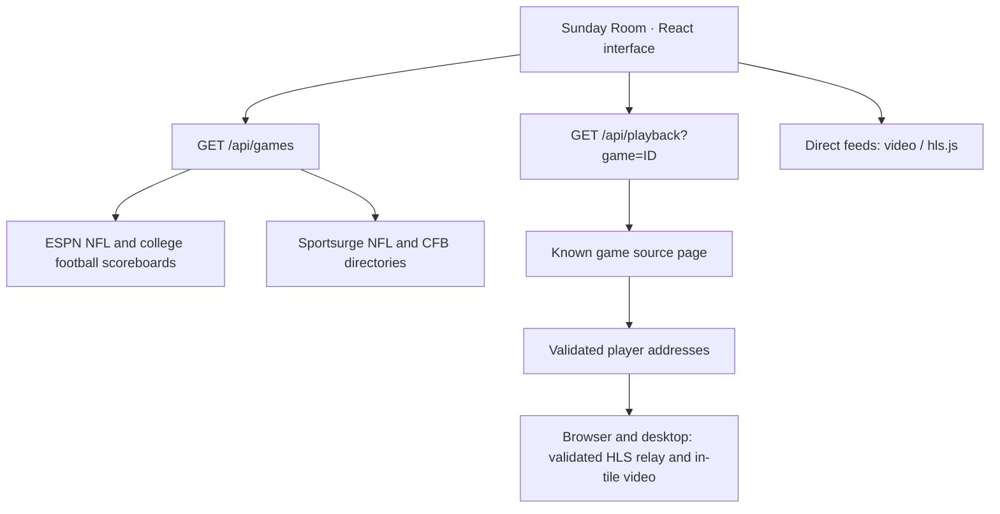

<p align="center">
  
</p>

# Sunday Room

**A personal NFL and college football viewing room. Four games, one screen, your choice of audio.**

Sunday Room brings live scores, a searchable game schedule, and flexible multiview playback into a dark, broadcast-inspired interface. Add a listed game to start its provider inside your room without pasting a stream URL.

This repository is **Sports-Hub**; **Sunday Room** is the application. It runs locally, with no application account, API key, or hosted deployment required.

<p align="center">
  <a href="#quick-start">Quick start</a> ·
  <a href="#the-viewing-experience">Features</a> ·
  <a href="#desktop-and-browser-playback">Playback modes</a> ·
  <a href="#development">Development</a> ·
  <a href="#troubleshooting">Troubleshooting</a>
</p>

> **Browser and desktop use the same HLS player.** Focus a game to reveal its custom playback controls. The room bar controls all streams.

## The viewing experience

| Feature | What it does |
| --- | --- |
| **Flexible multiview** | Choose four games, two games, a single game, or a larger focus view. Expand into theater mode or fullscreen. |
| **Automatic desktop playback** | Adding a game with a listed source starts its provider inside the tile. |
| **Backup servers** | Retry temporary lookup failures and try other listed servers when initial playback fails. Switch servers manually from the tile. |
| **One game on audio** | Focus a game to hear it. Room volume, mute, and play/pause controls keep the session manageable. |
| **Focused stream controls** | The focused stream has play/pause, volume, mute, fullscreen, quality selection, a seekable timeline, and picture-in-picture where supported. Other streams keep playing without control overlays. |
| **Live game center** | Follow scores, clocks, possession, down and distance, and available latest-play updates. |
| **Smart focus** | Follow red-zone action among selected games, with at least 20 seconds between automatic switches. |
| **Find your matchup** | Search by team or abbreviation, filter live games and red-zone activity, and save favorites. |
| **NFL and NCAA games** | Filter the score strip, game center, and schedule by league. Your room can hold games from both leagues. |
| **Spoiler-free mode** | Hide numeric scores and latest-play updates in the room. Broadcast video and provider overlays remain visible. |
| **Remember your room** | Save selected games, favorites, layout, volume, spoiler preference, and direct feed URLs on this device. |
| **Direct-feed support** | Connect compatible HLS or video URLs, with delay adjustment inside the available video buffer. |

<p align="center">
  
  <br>
  <sub>Custom AI-generated brand artwork. These illustrations are not application screenshots or broadcast footage.</sub>
</p>

## Quick start

### Requirements

- **Node.js 22.13 or newer**, with npm.
- **Git** to clone the repository.
- An internet connection for game data, provider pages, and video.
- **Windows** for the included double-click launcher. The desktop workflow has been verified on Windows; other operating systems have not been validated.

### Install and launch

```sh
git clone https://github.com/markybuilds/Sports-Hub.git
cd Sports-Hub
npm ci
npm run build
npm run desktop
```

After the first installation and build, Windows users can double-click **[Start Sunday Room.cmd](Start%20Sunday%20Room.cmd)** in the project folder.

The launcher starts Electron and its own local Next.js server on `127.0.0.1`. It uses port `51931` when available and selects another local port when that port is occupied or reserved. Keep the project folder and dependencies in place; this is a source-based launcher, not a packaged installer.

### Your first game day

1. Choose **All**, **NFL**, or **NCAA**. Find a matchup in the **Game center** or scoreboard strip and add it to your room. A listed provider starts inside the tile.
2. To restart a listed provider after stopping it, press **Play game** on its tile.
3. Add more games, up to four, and choose a layout from the room toolbar.
4. Use **Focus** to select a game's audio. Adjust volume or pause all feeds from the bottom bar.
5. Enable **Smart focus** to follow selected games entering the red zone, or use fullscreen for a dedicated viewing screen.

If a provider cannot start, allow its startup retries to finish or choose **Switch server**. A game without a listed stream stays in the room with a clear availability message. You can still add a direct feed through the tile's feed settings.

## Desktop and browser playback

Both modes use the same room interface and HLS player.

| Capability | Desktop viewer | Browser app |
| --- | --- | --- |
| Scores, schedule, favorites, layouts | Yes | Yes |
| Listed provider game | Supported HLS stream plays inside its tile | Supported HLS stream plays inside its tile |
| Multiple listed provider players inside the room | Up to four | Up to four |
| Compatible direct HLS/video feeds inside the room | Yes | Yes |
| Room audio and pause controls | Integrated video controls | Integrated video controls |
| Focused playback, volume, quality, and fullscreen | Yes | Yes |
| Provider startup failover | Automatic backups and manual switching | Automatic backup attempt and manual switching |

### Provider playback

Both apps play supported HLS streams through local routes that validate player, playlist, and media addresses. They do not embed the provider page.

The desktop shell runs the room in a sandboxed Electron window with its own local Next.js server. Focus changes reveal controls on the selected video without replacing the media element.

### Direct feeds

Use a tile's feed settings to connect an HTTPS HLS `.m3u8` URL or a browser-supported video URL. HTTP is accepted only for localhost addresses. A regular webpage URL is not a direct video feed.

HLS requests must be permitted by the provider's cross-origin policy. Delay settings work only within the video's seekable buffer; unrelated broadcasts cannot be automatically synchronized.

## Controls

| Control | Action |
| --- | --- |
| **Play game** | Restart a listed provider inside the room |
| **Focus** | Choose a game and its audio |
| **Switch server** | Try the next listed provider server |
| **Stop this game** | Close that provider player |
| **Smart focus** | Follow red-zone activity among selected games |
| **Theater** | Give the room more horizontal space |
| **Fullscreen** | Fill the display with the viewing room |
| **Fullscreen stream** | Fill the display with the focused game and its controls |
| **Video quality** | Choose Auto or an available HLS resolution |
| **LIVE** | Return to the stream's safe live position |

| Keyboard shortcut | Action |
| --- | --- |
| `1`–`4` | Focus a selected game and its audio |
| `M` | Toggle mute |
| `Space` | Play/pause the focused stream |
| `Left` / `Right` | Seek the focused stream backward / forward by ten seconds when seekable |
| `F` | Toggle fullscreen |
| `T` | Toggle theater mode |
| `?` | Open help |

Shortcuts apply while the room interface has keyboard focus. They are suspended in dialogs and editable controls.

## How it works



### Data and source resolution

- **Scores and game state:** ESPN's public NFL scoreboard and FBS college football scoreboard.
- **Game links:** the [Sportsurge NFL directory](https://isportsurge.ws/nfl/livestreams3) and [CFB directory](https://isportsurge.ws/cfb/livestreams2). Team pairs are matched within each league without assuming the directory's home/away order. Listings absent from ESPN's scoreboard still appear in the game center.
- **Refresh:** the visible room polls every 30 seconds. The server caches game data for 25 seconds and retains previous data with stale-data messages when an upstream fails.
- **Player lookup:** known game IDs resolve through validated source pages. Supported player addresses are cached for 90 seconds, with up to six distinct listed servers.
- **Browser stream:** the local server rewrites supported HLS playlists to opaque, short-lived media paths and streams player-specific media from validated Cloudflare R2 addresses published by trusted playlists. It refreshes an expired source up to twice per minute per server before trying the next listed server. Stream availability depends on the provider publishing a compatible player and HLS source.
- **Separation:** provider links never supply or overwrite scoreboard scores. No fabricated scores or prerecorded demo broadcasts are presented as live games.

### Desktop isolation

The room renderer uses sandboxing, context isolation, and browser security with no Node.js access. Its preload bridge exposes a limited set of operations. The main process validates IPC senders and game identifiers. HLS playback uses the same validated local stream routes as the browser app.

### Storage and network behavior

Preferences and manually entered feed URLs use local browser storage under `sunday-room:v1`. Browser and desktop sessions have separate storage. Adding a listed game starts playback; active provider sessions are not automatically restored after a restart.

There is no account service, database, or cloud preference sync. Local servers bind to `127.0.0.1`. Scoreboard, image, and player requests still contact their respective providers, whose own network behavior and tracking are outside this application's control. Saved feed URLs are not encrypted.

## Development

### Browser development

```sh
npm ci
npm run dev -- --port 3001
```

Open [http://127.0.0.1:3001](http://127.0.0.1:3001). Interface changes update through Next.js development mode.

### Desktop development

```sh
npm run build
npm run desktop
```

The desktop shell uses the production build when `.next/BUILD_ID` exists and falls back to a development server otherwise. For a fresh production build, close the viewer, rebuild, and launch it again. A browser dev server on port 3001 can run independently of the desktop server, which prefers port 51931.

### Commands

| Command | Purpose |
| --- | --- |
| `npm run dev` | Start the local Next.js development server |
| `npm run build` | Compile and type-check the production app |
| `npm run start` | Serve the production browser build |
| `npm run desktop` | Open Electron and its local server |
| `npm run typecheck` | Check TypeScript without emitting files |
| `npm test` | Run parser and desktop boundary tests |

No environment variables or API keys are required. Optional `SUNDAY_ROOM_DIAGNOSTICS=1` enables local desktop player diagnostics and captures under the ignored `.desktop-runtime/` directory.

### Project structure

```text
Sports-Hub/
├── app/
│   ├── api/games/route.ts       # Scoreboard and directory aggregation
│   ├── api/playback/route.ts    # Player lookup for known games
│   ├── api/stream/              # Validated browser HLS playlists and media
│   ├── play/[gameId]/route.ts   # Browser redirect to a player
│   ├── page.tsx                # Room, schedule, and preferences
│   └── globals.css             # Theme and responsive layouts
├── components/
│   ├── game-player.tsx         # Direct video and HLS
│   ├── browser-provider-player.tsx # Browser provider controls
│   ├── provider-player.tsx     # Desktop player state and positioning
│   └── ui/                     # Shared UI primitives
├── desktop/
│   ├── main.cjs                # Local server and player views
│   ├── preload.cjs             # Narrow desktop bridge
│   └── security.cjs            # Address, game ID, and bounds checks
├── docs/
│   ├── assets/                 # Generated README artwork
│   └── visuals.md              # Artwork provenance and prompts
├── lib/sunday.ts               # Models, parsers, matching, ranking
├── tests/                      # Node test runner suites
├── vendor/                     # Vendored styles and their license
└── Start Sunday Room.cmd       # Windows launcher
```

**Stack:** Next.js 16 · React 19 · TypeScript 5 · Electron 44 · hls.js · Tailwind CSS 4 · shadcn UI primitives · Lucide icons.

### Validation

```sh
npm test
npm run typecheck
npm run build
```

The automated tests cover NFL and NCAA directory extraction, scoreboard parsing, home/away matching, unmatched source listings, missing scores, red-zone ranking, feed validation, player ordering, source restrictions, and native view bounds.

To verify the custom browser player, start the app in one terminal and run the browser checks in another:

```sh
npm run dev -- --port 3100
```

```sh
npm run test:player
```

The browser check generates a local HLS fixture with two resolutions and plays four real video elements. It checks focused and room playback, audio focus, volume, quality changes, fullscreen, and mobile layout. Screenshots and results are saved in `work/player-verification/`. Windows uses installed Microsoft Edge. On other systems, run `npx playwright install chromium` first. Set `PLAYER_BASE_URL` to test another local port or `PLAYER_BROWSER_CHANNEL` to select another installed browser.

To run the same checks in the Electron app, build it first:

```sh
npm run build
npm run test:player:desktop
```

This opens a test window with a separate profile and closes it afterward. Electron screenshots and results are saved in `work/player-verification-electron/`. The tests also check live seeking, PiP state changes, and provider switches with generated media; they do not depend on live broadcasts.

Focused Play resumes only that game after Pause all. The room bar still controls every stream. Quality options come from the source's HLS renditions; native HLS quality stays browser-managed.

The video fills its tile and crops edges when its aspect ratio differs. Focused controls appear on mouse movement and hide after three idle seconds; keyboard focus and touch keep them accessible. The quality menu shows four options before scrolling and keeps its heading fixed.

Live provider verification decoded the Northwestern-Indiana game at 1280x720 in both browser and Electron, with advancing playback and quality options read from the actual manifest. Direct MP4 and HLS playback have also been checked. These checks establish behavior at the time of testing; they do not guarantee future upstream availability.

### Branch workflow

Use `developer` for ongoing work and `main` for the published baseline. Keep changes focused, include relevant validation in commit or pull request notes, and update this README when playback behavior or setup changes.

## Troubleshooting

| Symptom | What to check |
| --- | --- |
| **A game shows unavailable** | The provider may not have published a supported HLS stream. Try another listed server or connect a compatible direct feed. |
| **A game keeps connecting** | The provider may be slow or unavailable. Allow startup retries, then try **Switch server**. |
| **No source is listed** | A supported provider may not be published yet, or directory markup may have changed. Refresh the game center. |
| **The picture is live but silent** | Focus the game, unmute the room, and raise volume. Only the focused stream is audible. |
| **A direct feed fails** | Check that the URL points to video, is still valid, and permits browser requests. |
| **Scores differ from the video clock** | Data and broadcasts have different delays. Use spoiler-free mode; direct feeds can be delayed within their buffer. |
| **Electron cannot be found** | Run `npm ci`. If the binary download was skipped, run `node node_modules/electron/install.js`. |
| **The desktop window will not start** | Check `.desktop-runtime/server.log` and, if present, `.desktop-runtime/startup.log`. The viewer tries another local port when 51931 is occupied or reserved. |
| **The viewer shows an older build** | Close the viewer, run `npm run build`, and relaunch. |
| **Room preferences are unexpected** | Open **Room settings** → **Reset room and remove saved feeds** to clear saved choices and feed links. |

## Scope and availability

Sunday Room is an independent personal viewer, not an official NFL or NFL RedZone product. It does not provide a broadcast subscription, host streams, or grant rights to third-party content. Use sources you are authorized to access.

The ESPN endpoint is public and unversioned. Source pages, player URLs, access requirements, and stream availability can change. Player extraction supports the provider format implemented in `lib/sunday.ts`; it is not a universal streaming-site integration.

There is no packaged installer, automatic updater, or hosted service in this repository. Windows is the verified desktop platform.

## Artwork and third-party notices

The cover and multiview illustration were generated specifically for this repository. Their complete prompts and asset paths are in [docs/visuals.md](docs/visuals.md). They are conceptual artwork, not evidence of application behavior.

Team imagery and broadcast content belong to their respective owners. Vendored styles retain their [upstream license notice](vendor/shadcn-tailwind-4.13.0.LICENSE.md). No repository-wide open-source license has been declared.
