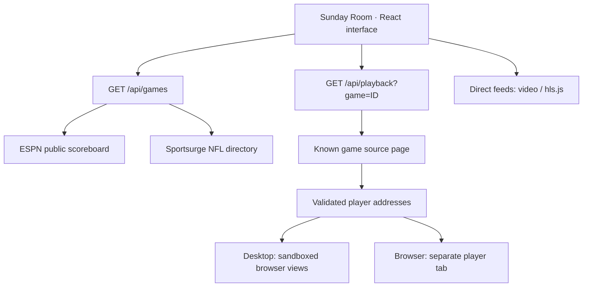

<p align="center">
  
</p>

# Sunday Room

**A personal NFL viewing room. Four games, one screen, your choice of audio.**

Sunday Room brings live scores, a searchable game schedule, and flexible multiview playback into a dark, broadcast-inspired interface. In the desktop viewer, choose a listed game and press **Play game** to watch it inside your room—no stream URL to copy.

This repository is **Sports-Hub**; **Sunday Room** is the application. It runs locally, with no application account, API key, or hosted deployment required.

<p align="center">
  <a href="#quick-start">Quick start</a> ·
  <a href="#the-viewing-experience">Features</a> ·
  <a href="#desktop-and-browser-playback">Playback modes</a> ·
  <a href="#development">Development</a> ·
  <a href="#troubleshooting">Troubleshooting</a>
</p>

> **Use the desktop viewer for integrated provider playback.** The browser app opens provider players in separate tabs because those providers restrict iframe embedding. Compatible direct video feeds can still play inside the browser room.

## The viewing experience

| Feature | What it does |
| --- | --- |
| **Flexible multiview** | Choose four games, two games, a single game, or a larger focus view. Pictures retain their 16:9 proportions. Connected games stay loaded when switching layouts; hidden games are muted. |
| **One-click desktop playback** | Resolve a listed game's current provider and start it inside its tile. |
| **Play your room** | Start all available selected provider games with one desktop action. |
| **Swap your lineup** | When all four slots are occupied, choose a game to replace directly from the schedule, scoreboard, or game center. |
| **Browse without reconnecting** | Open the schedule while streams stay loaded and muted, then return to your room. |
| **Backup servers** | Retry temporary lookup failures and try other listed servers when initial playback fails. Switch servers manually from the tile. |
| **One game on audio** | Choose a ready game from the audio selector or focus its tile. The toolbar shows volume, mute, and pause state. Failed feeds release audio focus. |
| **Live game center** | Follow scores, clocks, possession, down and distance, and available latest-play updates. |
| **Smart focus** | Follow red-zone action among connected games in your lineup, with at least 20 seconds between automatic switches. |
| **Find your matchup** | Search by team or abbreviation, filter live games and red-zone activity, and save favorites. |
| **Spoiler-free mode** | Hide numeric scores and latest-play updates in the room. Broadcast video and provider overlays remain visible. |
| **Remember your room** | Save selected games, favorites, layout, volume, spoiler preference, and direct feed URLs on this device. |
| **Direct-feed support** | Connect compatible HLS or video URLs, with delay adjustment inside the available video buffer. |

<p align="center">
  
  <br>
  <sub>Custom AI-generated brand artwork. These illustrations are not application screenshots or broadcast footage.</sub>
</p>

## Quick start

### Requirements

- **Node.js 22.13 or newer**, with npm.
- **Git** to clone the repository.
- An internet connection for game data, provider pages, and video.
- **Windows** for the included double-click launcher. The desktop workflow has been verified on Windows; other operating systems have not been validated.

### Install and launch

```sh
git clone https://github.com/markybuilds/Sports-Hub.git
cd Sports-Hub
npm ci
npm run build
npm run desktop
```

After the first installation and build, Windows users can double-click **[Start Sunday Room.cmd](Start%20Sunday%20Room.cmd)** in the project folder.

The launcher starts Electron and its own local Next.js server at `http://127.0.0.1:51931`. Keep the project folder and dependencies in place; this is a source-based launcher, not a packaged installer.

### Your first game day

1. Find a matchup in the **Game center** or scoreboard strip and add it to your room.
2. Press **Play game** on its tile. The desktop viewer looks up and opens the provider.
3. Add more games, up to four, and choose a layout from the room toolbar.
4. Use **Focus** to select a game's audio. Adjust volume or pause all feeds from the bottom bar.
5. Enable **Smart focus** to follow connected games entering the red zone, or use fullscreen for a dedicated viewing screen.

If a provider cannot start, allow its startup retries to finish or choose **Switch server**. Games without a supported source offer **Connect a feed** instead.

## Desktop and browser playback

Both modes use the same room interface, but their playback capabilities differ.

| Capability | Desktop viewer | Browser app |
| --- | --- | --- |
| Scores, schedule, favorites, layouts | Yes | Yes |
| Listed provider game | **Play game** opens inside its tile | **Open player** opens a separate tab |
| Multiple listed provider players inside the room | Up to four | Restricted by provider iframe policy |
| Compatible direct HLS/video feeds inside the room | Yes | Yes |
| Room audio and pause controls | Integrated players | Direct feeds; separate tabs have their own controls |
| Provider startup failover | Automatic backups and manual switching | Opens the primary player; provider controls are separate |

### Why the desktop viewer exists

The inspected provider pages send a `Content-Security-Policy: frame-ancestors` allowlist that excludes arbitrary websites and localhost. A normal web page cannot embed those players in an iframe.

The desktop shell opens each player as an independent, sandboxed Chromium `WebContentsView`, positioned inside its game tile. This uses ordinary top-level page navigation. It does not remove CSP headers, spoof an approved origin, disable browser security, or relay restricted video through the app server.

### Direct feeds

Use a tile's feed settings to connect an HTTPS HLS `.m3u8` URL or a browser-supported video URL. HTTP is accepted only for localhost addresses. A regular webpage URL is not a direct video feed.

HLS requests must be permitted by the provider's cross-origin policy. Delay settings work only within the video's seekable buffer; unrelated broadcasts cannot be automatically synchronized.

## Controls

| Control | Action |
| --- | --- |
| **Play game** | Start the provider inside the desktop room |
| **Focus** | Choose a game and its audio |
| **Switch server** | Try the next listed provider server |
| **Stop this game** | Close that provider player |
| **Smart focus** | Follow red-zone activity among connected games in your lineup |
| **Theater** | Give the room more horizontal space |
| **Fullscreen** | Fill the display with the viewing room; use the same button or Escape to exit. Embedded browsers without native fullscreen fill their available viewport. |

| Keyboard shortcut | Action |
| --- | --- |
| `1`–`4` | Focus a selected game and its audio |
| `M` | Toggle mute |
| `Space` | Play/pause integrated feeds |
| `F` | Toggle fullscreen |
| `T` | Toggle theater mode |
| `?` | Open help |

Shortcuts apply while the room interface has keyboard focus. They are suspended in dialogs and editable controls. A focused third-party player can handle its own keys; click back into the room to use room shortcuts.

## How it works



### Data and source resolution

- **Scores and game state:** ESPN's public NFL scoreboard.
- **Game links:** the [Sportsurge NFL directory](https://isportsurge.ws/nfl/livestreams3). Team pairs are matched without assuming the directory's home/away order.
- **Refresh:** the visible room polls every 30 seconds. The server caches game data for 25 seconds and retains previous data with stale-data messages when an upstream fails.
- **Player lookup:** known game IDs resolve through validated source pages. Supported player addresses are cached for 90 seconds, with up to six distinct listed servers.
- **Separation:** provider links never supply or overwrite scoreboard scores. No fabricated scores or prerecorded demo broadcasts are presented as live games.

### Desktop isolation

Remote player views use sandboxing, context isolation, and browser security. They have no Node.js access or privileged preload script. Player popups, downloads, and permission requests are blocked, and top-level player navigation is restricted to the resolved address.

The local interface receives a narrow preload bridge for player lifecycle, tile bounds, and playback controls. The main process validates the IPC sender and game identifiers, limits the room to four provider views, and clips view bounds to the window.

### Storage and network behavior

Preferences and manually entered feed URLs use local browser storage under `sunday-room:v1`. Browser and desktop sessions have separate storage. Playback starts when you press Play; active provider sessions are not automatically restored after a restart.

There is no account service, database, or cloud preference sync. Local servers bind to `127.0.0.1`. Scoreboard, image, and player requests still contact their respective providers, whose own network behavior and tracking are outside this application's control. Saved feed URLs are not encrypted.

## Development

### Browser development

```sh
npm ci
npm run dev -- --port 3001
```

Open [http://127.0.0.1:3001](http://127.0.0.1:3001). Interface changes update through Next.js development mode.

### Desktop development

```sh
npm run build
npm run desktop
```

The desktop shell uses the production build when `.next/BUILD_ID` exists and falls back to a development server otherwise. For a fresh production build, close the viewer, rebuild, and launch it again. A browser dev server on port 3001 can run independently of the desktop server on port 51931.

### Commands

| Command | Purpose |
| --- | --- |
| `npm run dev` | Start the local Next.js development server |
| `npm run build` | Compile and type-check the production app |
| `npm run start` | Serve the production browser build |
| `npm run desktop` | Open Electron and its local server |
| `npm run typecheck` | Check TypeScript without emitting files |
| `npm test` | Run parser and desktop boundary tests |

No environment variables or API keys are required. Optional `SUNDAY_ROOM_DIAGNOSTICS=1` enables local desktop player diagnostics and captures under the ignored `.desktop-runtime/` directory.

### Project structure

```text
Sports-Hub/
├── app/
│   ├── api/games/route.ts       # Scoreboard and directory aggregation
│   ├── api/playback/route.ts    # Player lookup for known games
│   ├── play/[gameId]/route.ts   # Browser redirect to a player
│   ├── page.tsx                # Room, schedule, and preferences
│   └── globals.css             # Theme and responsive layouts
├── components/
│   ├── game-player.tsx         # Direct video and HLS
│   ├── provider-player.tsx     # Desktop player state and positioning
│   └── ui/                     # Shared UI primitives
├── desktop/
│   ├── main.cjs                # Local server and player views
│   ├── preload.cjs             # Narrow desktop bridge
│   └── security.cjs            # Address, game ID, and bounds checks
├── docs/
│   ├── assets/                 # Generated README artwork
│   └── visuals.md              # Artwork provenance and prompts
├── lib/sunday.ts               # Models, parsers, matching, ranking
├── tests/                      # Node test runner suites
├── vendor/                     # Vendored styles and their license
└── Start Sunday Room.cmd       # Windows launcher
```

**Stack:** Next.js 16 · React 19 · TypeScript 5 · Electron 44 · hls.js · Tailwind CSS 4 · shadcn UI primitives · Lucide icons.

### Validation

```sh
npm test
npm run typecheck
npm run build
```

The current 82 automated tests cover directory and scoreboard parsing, source matching and restrictions, native geometry, renderer zoom, stalled-stream health, cancellation and stale player events, direct-feed recovery and live seeking, saved-room validation, scoreboard recovery, and refresh-cache behavior.

Recent polish adds desktop **Play room**, direct game replacement, an audio selector, schedule browsing without reconnecting streams, and an **In your lineup** shelf for games outside the current layout. Native players continue monitoring playback after startup; direct HLS feeds make bounded recovery attempts before offering a manual retry. Saved preferences reject malformed values and preserve an explicitly empty room. Source-only game selections and saved feeds follow official game IDs when scores recover. Spoiler-free mode also hides team records and uses stable ordering. Compact player artwork scales to its tile. The **Find a game** picker (toolbar **+** or **/**) searches team names, cities, and abbreviations without leaving fullscreen. It includes live and favorite filters, supports game replacement, and restores keyboard focus when closed. Browser playback failures offer a same-game retry and a source fallback. Desktop fullscreen lets Escape close a picker or audio menu first, then exit fullscreen on the next press. Fullscreen also keeps keyboard focus within the room; volume and delay sliders have accessible names and larger hit areas. Team-code searches such as CHI and NE use exact abbreviations. Pause reaches provider videos that load late, and live-delay changes wait for a usable buffer. See [the verification record](docs/qa-2026-09-20.md) for checked flows.

Manual Windows verification has included four simultaneous live provider broadcasts, global pause/resume, layout switching without reconnecting, fullscreen entry/exit, and dialogs above native player surfaces. Browser layouts have been checked at 320, 768, 1024, and 1440 pixels wide. Direct MP4 and HLS playback have also been checked. These checks establish behavior at the time of testing; they do not guarantee future upstream availability.

### Branch workflow

Use `developer` for ongoing work and `main` for the published baseline. Keep changes focused, include relevant validation in commit or pull request notes, and update this README when playback behavior or setup changes.

## Troubleshooting

| Symptom | What to check |
| --- | --- |
| **The browser opens another tab** | This is the browser provider playback path. Launch the desktop viewer for integrated multiview. |
| **A game keeps connecting** | The provider may be slow or unavailable. Allow startup retries, then try **Switch server**. |
| **No source is listed** | A supported provider may not be published yet, or directory markup may have changed. Refresh the game center. |
| **The picture is live but silent** | Focus the game, unmute the room, and raise volume. Hidden native player views are muted. |
| **A direct feed fails** | Check that the URL points to video, is still valid, and permits browser requests. |
| **Scores differ from the video clock** | Data and broadcasts have different delays. Use spoiler-free mode; direct feeds can be delayed within their buffer. |
| **Electron cannot be found** | Run `npm ci`. If the binary download was skipped, run `node node_modules/electron/install.js`. |
| **The desktop window will not start** | Ensure port 51931 is available. Check `.desktop-runtime/server.log` and, if present, `.desktop-runtime/startup.log`. |
| **The viewer shows an older build** | Close the viewer, run `npm run build`, and relaunch. |
| **Room preferences are unexpected** | Open **Room settings** → **Reset room and remove saved feeds** to clear saved choices and feed links. |

## Scope and availability

Sunday Room is an independent personal viewer, not an official NFL or NFL RedZone product. It does not provide a broadcast subscription, host streams, or grant rights to third-party content. Use sources you are authorized to access.

The ESPN endpoint is public and unversioned. Source pages, player URLs, access requirements, and stream availability can change. Player extraction supports the provider format implemented in `lib/sunday.ts`; it is not a universal streaming-site integration.

There is no packaged installer, automatic updater, or hosted service in this repository. Windows is the verified desktop platform.

## Artwork and third-party notices

The cover and multiview illustration were generated specifically for this repository. Their complete prompts and asset paths are in [docs/visuals.md](docs/visuals.md). They are conceptual artwork, not evidence of application behavior.

Team imagery and broadcast content belong to their respective owners. Vendored styles retain their [upstream license notice](vendor/shadcn-tailwind-4.13.0.LICENSE.md). No repository-wide open-source license has been declared.
