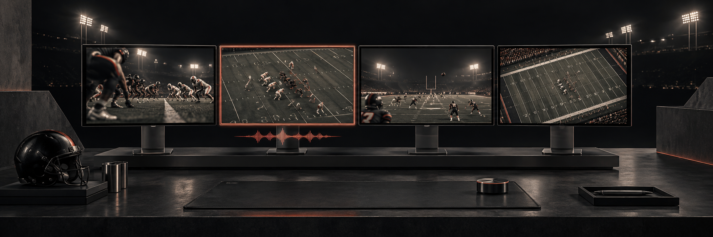
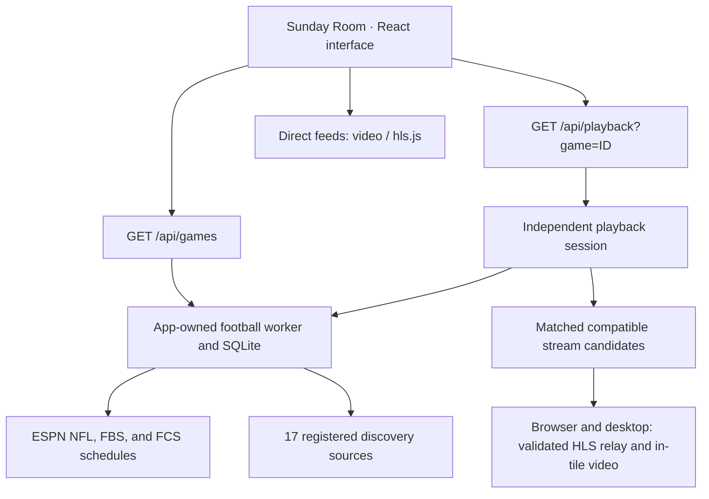

<p align="center">
  
</p>

# Sunday Room

**A personal NFL and college football viewing room. Four games, one screen, your choice of audio.**

Sunday Room brings live scores, a searchable game schedule, and flexible multiview playback into a dark, broadcast-inspired interface. Add a listed live game to start its provider inside your room without pasting a stream URL.

This repository is **Sports-Hub**; **Sunday Room** is the application. It runs locally, with no application account, API key, or hosted deployment required.

<p align="center">
  <a href="#quick-start">Quick start</a> ·
  <a href="#the-viewing-experience">Features</a> ·
  <a href="#desktop-and-browser-playback">Playback modes</a> ·
  <a href="#development">Development</a> ·
  <a href="#troubleshooting">Troubleshooting</a>
</p>

> **Browser and desktop use the same HLS player.** Focus a game to reveal its custom playback controls.

## The viewing experience

| Feature | What it does |
| --- | --- |
| **Flexible multiview** | Choose four games, two games, a single game, or a larger focus view. Expand into theater mode or fullscreen. |
| **Automatic live playback** | Live games with listed sources start when added or restored in browser and desktop rooms. |
| **Backup servers** | Retry temporary lookup failures and try other listed servers when initial playback fails. Switch servers manually from the tile. |
| **One game on audio** | Focus a game to hear it, then use its custom volume, mute, and play/pause controls. |
| **Focused stream controls** | The focused stream has play/pause, volume, mute, fullscreen, quality selection, a seekable timeline, and picture-in-picture where supported. Other streams keep playing without control overlays. |
| **Live game center** | Follow scores, clocks, possession, down and distance, and available latest-play updates. |
| **Smart focus** | Follow red-zone action among selected games, with at least 20 seconds between automatic switches. |
| **Find your matchup** | Search by team or abbreviation, filter live games and red-zone activity, and save favorites. |
| **NFL and NCAA games** | Filter the score strip, game center, and schedule by league. Your room can hold games from both leagues. |
| **Spoiler-free mode** | Hide numeric scores and latest-play updates in the room. Broadcast video and provider overlays remain visible. |
| **Remember your room** | Save selected games, favorites, layout, volume, spoiler preference, and direct feed URLs on this device. |
| **In-app update** | The installed Windows app checks GitHub Releases for a newer build and offers one button that downloads it, then installs and relaunches. |
| **Direct-feed support** | Connect compatible HLS or video URLs, with delay adjustment inside the available video buffer. |

<p align="center">
  
  <br>
  <sub>Custom AI-generated brand artwork. These illustrations are not application screenshots or broadcast footage.</sub>
</p>

## Quick start

### Requirements

- **Node.js 24.6 or newer**, with npm. The pipeline uses Node's SQLite, TypeScript runtime support, and system certificate trust.
- **Git** to clone the repository.
- An internet connection for game data, provider pages, and video.
- **Windows** for the included double-click launcher. The desktop workflow has been verified on Windows; other operating systems have not been validated.

### Install and launch

```sh
git clone https://github.com/markybuilds/Sports-Hub.git
cd Sports-Hub
npm ci
npm run desktop
```

After installing dependencies, Windows users can double-click **[Start Sunday Room.cmd](Start%20Sunday%20Room.cmd)** in the project folder.

The launcher starts Electron and its own local Next.js server on `127.0.0.1`. It uses port `51931` when available and selects another local port when that port is occupied or reserved. Keep the project folder and dependencies in place; this is a source-based launcher, not a packaged installer.

On Windows, desktop launches and Electron tests prepare a branded runtime in `.desktop-runtime/electron`. The taskbar and Task Manager use the Sunday Room logo. Preparation refreshes the runtime when Electron or `public/favicon.svg` changes and preserves the original Electron installation. Close development windows before a runtime refresh.

Run `npm run desktop:branding` on Windows to check the running executable, native icons, and taskbar metadata. `npm run desktop:icons:check` checks that the desktop icons match `public/favicon.svg`. Release checks verify the packaged app before its installer is uploaded.

### Your first game day

1. Choose **All**, **NFL**, or **NCAA**. Find a matchup in the **Game center** or scoreboard strip and add it to your room. Live games with listed sources start automatically, including saved selections when you reopen the room.
2. To restart a listed provider after stopping it, press **Play game** on its tile.
3. Add more games, up to four, and choose a layout from the room toolbar.
4. Use **Focus** to select a game, then adjust volume or pause it with the controls over its video.
5. Enable **Smart focus** to follow selected games entering the red zone, or use fullscreen for a dedicated viewing screen.

If a provider cannot start, allow its startup retries to finish or choose **Switch server**. A game without a listed stream stays in the room with a clear availability message. You can still add a direct feed through the tile's feed settings.

## Desktop and browser playback

Both modes use the same room interface and HLS player.

| Capability | Desktop viewer | Browser app |
| --- | --- | --- |
| Scores, schedule, favorites, layouts | Yes | Yes |
| Listed provider game | Supported HLS stream plays inside its tile | Supported HLS stream plays inside its tile |
| Multiple listed provider players inside the room | Up to four | Up to four |
| Compatible direct HLS/video feeds inside the room | Yes | Yes |
| Room audio and pause controls | Integrated video controls | Integrated video controls |
| Focused playback, volume, quality, and fullscreen | Yes | Yes |
| Provider startup failover | Automatic backups and manual switching | Automatic backup attempt and manual switching |

### Provider playback

Both apps play supported HLS streams through local routes that validate player, playlist, and media addresses. They do not embed the provider page.

The desktop shell runs the room in a sandboxed Electron window with its own local Next.js server. Focus changes reveal controls on the selected video without replacing the media element.

### Direct feeds

Use a tile's feed settings to connect an HTTPS HLS `.m3u8` URL or a browser-supported video URL. HTTP is accepted only for localhost addresses. A regular webpage URL is not a direct video feed.

HLS requests must be permitted by the provider's cross-origin policy. Delay settings work only within the video's seekable buffer; unrelated broadcasts cannot be automatically synchronized.

## Controls

| Control | Action |
| --- | --- |
| **Play game** | Start a listed provider inside the room |
| **Focus** | Choose a game and its audio |
| **Switch server** | Try the next listed provider server |
| **Smart focus** | Follow red-zone activity among selected games |
| **Theater** | Give the room more horizontal space |
| **Fullscreen** | Fill the display with the viewing room |
| **Fullscreen stream** | Fill the display with the focused game and its controls |
| **Video quality** | Choose Auto or an available HLS resolution |
| **LIVE** | Return to the stream's safe live position |

| Keyboard shortcut | Action |
| --- | --- |
| `1`–`4` | Focus a selected game and its audio |
| `M` | Toggle mute |
| `Space` | Play/pause the focused stream |
| `Left` / `Right` | Seek the focused stream backward / forward by ten seconds when seekable |
| `F` | Toggle fullscreen |
| `T` | Toggle theater mode |
| `?` | Open help |

Shortcuts apply while the room interface has keyboard focus. They are suspended in dialogs and editable controls.

## How it works



### Data and source resolution

- ESPN supplies NFL, FBS, and FCS schedules. The pipeline merges overlapping college events by ESPN ID and records season-specific team membership separately.
- The [source registry](lib/football/adapters/sources.ts) accounts for 17 discovery URLs. Automatic matching requires both teams and compatible kickoff evidence. Ambiguous, stale, and unmatched listings stay in internal diagnostics.
- The worker refreshes schedules independently of the visible room. On an outage, it keeps bounded last-good data with a stale warning and prevents unsafe new associations.
- Playback uses stable candidate and session IDs. Supported media plays through the existing custom player. A fetched listing is not evidence of playable video, and sources without a compatible resolver remain unavailable.
- The local relay validates provider addresses and scopes media access to the selected session and stream generation. Recovery first refreshes a locator, then tries another eligible candidate within a bounded budget.
- ESPN alone supplies scores and final-game state. Provider failures never mark a game finished.

### Desktop isolation

The room renderer uses sandboxing, context isolation, and browser security with no Node.js access. HLS playback uses the same validated local stream routes as the browser app. The desktop process supervises the local server, and a worker owns the pipeline database and collection jobs.

### Storage and network behavior

Preferences and manually entered feed URLs use local browser storage under `sunday-room:v1`. Browser and desktop sessions have separate storage. Selected live games reconnect when the room opens or a compatible source becomes available. Legacy source IDs migrate only after a confident match. Saved feed URLs remain preferences when their active playback ends.

When ESPN confirms a final, the game leaves live discovery immediately. Existing playback has five minutes to finish. The persisted deadline does not reset on another poll or restart. The same rule applies to manual game feeds.

The pipeline stores bounded observations, diagnostics, identity mappings, and final deadlines in local SQLite. Desktop data lives in Electron's user-data directory. Browser development defaults to `.desktop-runtime/`. Collection runs while the desktop app is open, including when minimized, and stops with its owned server. There is no cloud collector or preference sync. Local servers bind to `127.0.0.1`; provider requests still use the internet. Saved feed URLs are not encrypted.

`npm run dev` and `npm run start` use `.desktop-runtime/` when `SUNDAY_ROOM_DATA_DIR` is unset. Set `SUNDAY_ROOM_DATA_DIR` to a writable directory when starting Next.js directly, including `.next/standalone/server.js`.

## Development

### Browser development

```sh
npm ci
npm run dev -- --port 3001
```

Open [http://127.0.0.1:3001](http://127.0.0.1:3001). Interface changes update through Next.js development mode.

### Component stories

```sh
npm run storybook
```

Open [http://localhost:6006](http://localhost:6006) to browse the components used by the app. Stories use the app's global styles. Player stories use a local sample video, including a Storybook-only HLS adapter for provider sessions. Run `npm run storybook:media` to regenerate the clip. Source inventory, playback sessions, and desktop update stories use in-memory responses, so their controls cannot contact a provider or start an installer.

Run `npm run storybook:check` after adding a component. It follows static imports from the app and its stories, then checks that every component used by the app appears in a story. Run `npm run build-storybook` to verify the full catalog builds. The generated `storybook-static/` directory is ignored.

### Desktop development

```sh
npm run desktop
```

The desktop shell always starts a development server from source. Save changes to see them in the app. Local development and Electron tests do not need a production build or `dist-electron`. A browser dev server on port 3001 can run independently of the desktop server, which prefers port 51931.

Run `npm run desktop:smoke` to check the source Electron window and game-data API with a separate profile.

### Windows installer

CI builds the Windows installer from the same source used for local development. It runs `npm run desktop:smoke:packaged` against an isolated package, checks that its version matches the checkout, and requires the game schedule to load. Artifact-dependent updater tests run only when CI sets `SUNDAY_ROOM_RELEASE_DIR`.

The installer is `dist-electron/Sunday-Room-<version>-Setup-x64.exe`. The installed app runs its bundled Next.js server without a separate Node.js installation. Its logs are in the `logs` folder under the Electron user data directory.

The `Electron release` workflow builds and tests the Windows installer on pull requests to `main`, manual runs, and `v*` tags. Manual runs store an Actions artifact. A tag must match the version in `package.json`, such as `v1.0.0`; after the packaged app passes its smoke check, the workflow creates a draft GitHub release with the installer. Review and publish that draft in GitHub when ready. A draft is invisible to the updater, so a release that is never published is never offered. The installer is unsigned.

### Commands

| Command | Purpose |
| --- | --- |
| `npm run dev` | Start the local Next.js development server |
| `npm run build` | Compile and type-check the production app |
| `npm run start` | Serve the production browser build |
| `npm run desktop` | Open Electron from source with its development server |
| `npm run desktop:package` | Build the Windows x64 NSIS installer from the compiled app |
| `npm run desktop:smoke` | Check the source Electron window and game-data API |
| `npm run desktop:smoke:packaged` | Verify an isolated release package in CI |
| `npm run typecheck` | Check TypeScript without emitting files |
| `npm run storybook` | Open the component catalog on port 6006 |
| `npm run storybook:check` | Check story coverage for components used by the app |
| `npm run build-storybook` | Build the static component catalog |
| `npm test` | Run matching, lifecycle, storage, relay, and desktop tests |
| `npm run lint` | Check code and module boundaries |
| `npm run diagnostics:football` | Print bounded local source and matching diagnostics |

No API key is required. Set `SUNDAY_ROOM_DATA_DIR` when inspecting a database outside the browser development directory. Run `npm run diagnostics:football -- --listings` to include up to 25 parsed listings and their matching reasons. Internal diagnostics do not appear in the viewing UI.

### Project structure

```text
Sports-Hub/
├── app/
│   ├── api/games/route.ts       # Validated viewer snapshot
│   ├── api/playback/route.ts    # Playback sessions
│   ├── api/stream/              # Validated browser HLS playlists and media
│   ├── play/[gameId]/route.ts   # Deep link into the room
│   ├── page.tsx                # Room, schedule, and preferences
│   └── globals.css             # Theme and responsive layouts
├── components/
│   ├── game-player.tsx         # Direct video and HLS
│   ├── browser-provider-player.tsx # Session lifecycle and recovery
│   └── ui/                     # Shared UI primitives
├── desktop/
│   ├── main.cjs                # Desktop window and owned local server
│   ├── server-supervisor.cjs   # Stop the Next process tree with Electron
│   └── preload.cjs             # Desktop identification
├── docs/
│   ├── assets/                 # Generated README artwork
│   └── visuals.md              # Artwork provenance and prompts
├── lib/football/               # Contracts, matching, adapters, and worker
├── lib/sunday.ts               # Score parsing and shared display helpers
├── tests/                      # Node test runner suites
├── vendor/                     # Vendored styles and their license
└── Start Sunday Room.cmd       # Windows launcher
```

**Stack:** Next.js 16 · React 19 · TypeScript 5 · Electron 44 · hls.js · Tailwind CSS 4 · shadcn UI primitives · Lucide icons.

### Validation

```sh
npm test
npm run typecheck
npm run lint
npm run desktop:smoke
npm run storybook:check
```

The automated tests cover source extraction, dated matching, ambiguous listings, overlapping college schedules, season membership, persisted final deadlines, session isolation, relay restrictions, and worker ownership.

To verify the custom browser player, start the app in one terminal and run the browser checks in another:

```sh
npm run dev -- --port 3100
```

```sh
npm run test:player
```

The browser check generates a local HLS fixture with two resolutions and plays four real video elements. It checks focused and room playback, audio focus, volume, quality changes, fullscreen, and mobile layout. Screenshots and results are saved in `work/player-verification/`. Windows uses installed Microsoft Edge. On other systems, run `npx playwright install chromium` first. Set `PLAYER_BASE_URL` to test another local port or `PLAYER_BROWSER_CHANNEL` to select another installed browser.

To run the same checks in the source Electron app:

```sh
npm run test:player:desktop
```

This opens a test window with a separate profile and closes it afterward. Electron screenshots and results are saved in `work/player-verification-electron/`. The tests also check live seeking, PiP state changes, and provider switches with generated media; they do not depend on live broadcasts.

Play and pause affect only the focused game. Quality options come from the source's HLS renditions; native HLS quality stays browser-managed.

Player tiles follow the video aspect ratio without cropping or stretching. Focused controls and the mouse cursor hide after three idle seconds and return on mouse movement; keyboard focus and touch keep controls accessible. Smart focus is in the multiview toolbar. The quality menu shows four options before scrolling and keeps its heading fixed.

Live provider verification decoded the Northwestern-Indiana game at 1280x720 in both browser and Electron, with advancing playback and quality options read from the actual manifest. Direct MP4 and HLS playback have also been checked. These checks establish behavior at the time of testing; they do not guarantee future upstream availability.

### Branch workflow

Use `developer` for ongoing work and `main` for the published baseline. Keep changes focused, include relevant validation in commit or pull request notes, and update this README when playback behavior or setup changes.

## Troubleshooting

| Symptom | What to check |
| --- | --- |
| **A game shows unavailable** | The provider may not have published a supported HLS stream. Try another listed server or connect a compatible direct feed. |
| **A game keeps connecting** | The provider may be slow or unavailable. Allow startup retries, then try **Switch server**. |
| **No source is listed** | A supported provider may not be published yet, or directory markup may have changed. Refresh the game center. |
| **The picture is live but silent** | Focus the game, unmute the room, and raise volume. Only the focused stream is audible. |
| **A direct feed fails** | Check that the URL points to video, is still valid, and permits browser requests. |
| **Scores differ from the video clock** | Data and broadcasts have different delays. Use spoiler-free mode; direct feeds can be delayed within their buffer. |
| **Electron cannot be found** | Run `npm ci`. If the binary download was skipped, run `node node_modules/electron/install.js`. |
| **The desktop window will not start** | Check `.desktop-runtime/server.log` and, if present, `.desktop-runtime/startup.log` for a source checkout. For an installed app, check `logs/server.log` and `logs/startup.log` under the Electron user data directory. The viewer tries another local port when 51931 is occupied or reserved. |
| **The viewer shows older code** | Check out the intended source branch and relaunch with `npm run desktop`. |
| **Room preferences are unexpected** | Open **Room settings** → **Reset room and remove saved feeds** to clear saved choices and feed links. |

## Scope and availability

Sunday Room is an independent personal viewer, not an official NFL or NFL RedZone product. It does not provide a broadcast subscription, host streams, or grant rights to third-party content. Use sources you are authorized to access.

The ESPN endpoint is public and unversioned. Source pages, player URLs, access requirements, and stream availability can change. Player extraction supports the provider format implemented in `lib/sunday.ts`; it is not a universal streaming-site integration.

There is no hosted service in this repository. Windows is the verified desktop platform.

### Updates

The installed Windows app looks for a newer release on its own, so publishing a release is enough to tell people about it. It checks at launch and then keeps looking in the background — daily by default, hourly or weekly if you prefer, or off — and raises a system notification when it finds one, so it reaches you even when Sunday Room is behind another window. **Check for updates** always asks immediately.

A newer version shows in a top-right popup and in **Room settings**, and one button walks the whole chain: it downloads the release, then installs and relaunches. Release notes stay on the release page rather than in the popup, and **Dismiss** keeps the popup closed for that version until something newer appears.

A development build reaches GitHub and shows every one of those screens, so the update flow can be exercised before packaging. It refuses to download and install, because those write to the machine and run an unsigned binary.

The updater is [`electron-updater`](https://github.com/electron-userland/electron-builder/tree/master/packages/electron-updater). `desktop/main.cjs` constructs it and `desktop/update.cjs` wires its events to the state machine the settings panel and the popup already speak, so the library owns the transfer and the checksum while this repo owns the wording.

**A release must publish `latest.yml` and the blockmap** alongside the installer. Without them the updater cannot resolve an update at all and every installed copy stays where it is. The workflow uploads all three, and a release published before this change has none, so it is invisible to the app until the next one.

**The feed is a plain URL**, `https://github.com/TheDarkSkyXD/Sports-Hub/releases/latest/download`, handed to the updater at runtime rather than baked in. The updater resolves `latest.yml` against that base, and that path is the GitHub one that always points at the newest published release's assets.

**An installed app takes updates from one address only.** The feed is fixed, because it decides which installer the app will run and until the binary is signed there is no signature to check it against; the generic provider resolves against whatever base it is given. A development build *is* rewritable, through `SUNDAY_ROOM_UPDATE_SOURCE` or the settings field, which is how the flow gets exercised against a fork before packaging. The reasoning is in [`docs/desktop-updates.md`](docs/desktop-updates.md).

To sign the installer, set `CSC_LINK` and `CSC_KEY_PASSWORD` in the repository secrets. The workflow then fails if a certificate is configured but the installer comes out unsigned, so signing cannot stop working unnoticed. Today neither is set, and the workflow says so in its summary.

A downloaded installer is checked against the `sha512` the published record names before it is run. That proves the bytes are the bytes the record names. It proves nothing about whether the release itself was legitimate, because the binary is still unsigned. Signing the Windows binary is the follow-up this makes more urgent.

A downloaded installer is checked against the byte count and the `sha256` the release publishes before it is renamed into place and run. That proves the bytes are the bytes GitHub published. It proves nothing about whether the release itself was legitimate, because the installer is still unsigned. Signing the Windows binary is the follow-up this makes more urgent.

## Artwork and third-party notices

The cover and multiview illustration were generated specifically for this repository. Their complete prompts and asset paths are in [docs/visuals.md](docs/visuals.md). They are conceptual artwork, not evidence of application behavior.

Team imagery and broadcast content belong to their respective owners. Vendored styles retain their [upstream license notice](vendor/shadcn-tailwind-4.13.0.LICENSE.md). No repository-wide open-source license has been declared.
